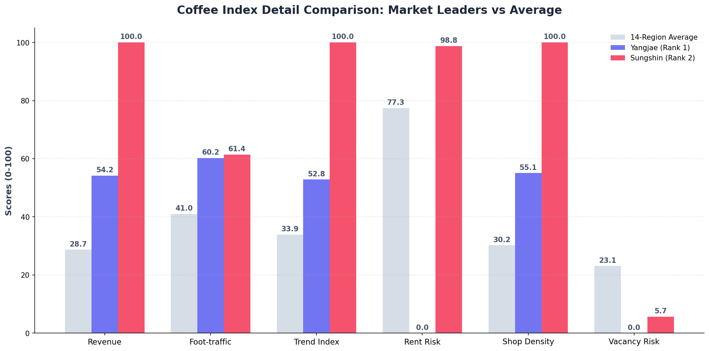

# 🏆 서울시 카페 창업 적합도 지수 (Coffee Index) 최종 보고서 (v1.1)

## 1. 데이터 구조 및 제약사항 (Data Structure)
본 분석은 오프라인 실물 지표(매출, 유동, 임대 등)에 온라인 관심도 지표를 새롭게 융합한 "Coffee Index" 산출을 목적으로 합니다.
- **분석 범위**: 사전 필터링된 서울시 내 저평가/유망 14개 상권 (양재역, 성신여대, 구로디지털단지역 등)
- **전체 구성 지표 (총 6종)**
  - **수요/성장 (Positive, 가점 요소)**: 당월 추정매출액 (25%), 총 유동인구수 (20%), 네이버 검색 트렌드 지수 (15%)
  - **비용/리스크 (Negative, 감점 요소)**: 상가 임대가격지수 (15%), 커피 점포수/경쟁도 (15%), 소규모 상가 공실률 (10%)
- **분석 기간**: 2020년 1분기 ~ 2024년 4분기 (결합 가능 최신 분기 데이터 기준)

## 1.2 지수 산출 상세 로직 (Index methodology)
본 보고서의 핵심 지표인 **Coffee Index**와 그 구성 요소인 **Trend Index**는 다음의 산출 방식을 통해 도출되었습니다.

### A. Trend Index (지역 트렌드 지수)
네이버 검색 트렌드 상대값(0~100) 데이터를 기반으로 온라인 화제성을 측정합니다.
- **Momentum (60%)**: 직전 4주 대비 최근 4주 검색량의 증가율 (성장세)
- **Concentration (25%)**: 기준 키워드(서울 전체) 대비 해당 지역의 검색 점유율 (화제 집중도)
- **Sustainability (15%)**: 최근 4주 내 검색량이 상승 추세를 보인 주간의 비중 (지속성)

### B. Coffee Index (종합 창업 적합도 지수)
오프라인 실계 데이터와 온라인 트렌드를 결합하여 0~100 스케일의 최종 점수를 산출합니다.
- **가점 지표 (Positive Factors)**: 
  - `(매출 × 0.25 + 유동인구 × 0.20 + 지역트렌드 × 0.15)`
- **감점 지표 (Negative Factors)**: 
  - `(임대료 × 0.15 + 점포수 × 0.15 + 공실률 × 0.10)`
- **최종식**: `Coffee Index = (Positive_Factors - Negative_Factors)` 를 0~100으로 정규화

- **제약사항**: 여러 출처(공단, 서울시, 네이버)의 데이터가 혼재되어 각기 다른 기간과 상권 코드 명칭을 사용함. 특정 상권의 경우 매출은 높으나 점포 단위로 환산 시 평균 생존율 등 세부 지표의 변동성이 클 수 있음.

## 2. 전처리 & 정합성 이슈 (Preprocessing & Integrity)
- **공간 정합성 확보**: 서울시 상권코드와 부동산/공실률 데이터의 '상권명'이 상이한 문제를 해결하기 위해, 기준이 되는 매출 데이터의 `상권_코드_명`을 바탕으로 1:1 매핑 데이터셋(`regional_trend_index_mapped.csv`)을 생성함.
- **시계열 정렬 및 결측치 처리**: 
  - 분기(Quarter) 단위 기준으로 모든 데이터를 통합(Melt & Groupby). 
  - 특정 분기에 데이터가 없는 경우(예: 일부 공실률 지표), 해당 상권의 전후 데이터를 기반으로 Forward Fill(ffill) / Backward Fill(bfill)을 적용해 시계열의 끊김을 방지함.
- **스케일 불균형 해소**: 매출액(백억 단위)과 공실률(%) 등 단위가 근본적으로 다른 6개 지표를 모두 0~100 사이의 `Min-Max Scaling`으로 정규화하여 가중치 공식이 정상 작동하도록 처리.

## 3. 문제 정의 (Problem Definition)
> **"단순히 매출이 높은 곳이 창업하기 가장 좋은 곳인가?"**
- **한계점**: 기존 분석은 매출 규모가 크거나 유동인구가 많은 대형 상권(예: 강남, 중구)을 1순위로 추천하는 경향이 있었음. 그러나 이곳은 임대료 상승과 경쟁 과열, 높은 고정비로 인해 개인 창업자의 단기 생존율이 매우 취약함.
- **분석 목표**: 따라서 본 분석은 **"수요와 온라인 관심도는 높게 유지되거나 팽창 중이면서도, 임대료 폭등이 적고 공실 및 점포 쏠림 현상이 덜한 '숨겨진 꿀상권(Hidden Gem)'을 도출"**하는 것을 최우선 과제로 정의함.

## 3.2 주요 상권별 상세 스코어 분석 (Detailed Breakdown)
최상위 랭킹을 차지한 두 상권의 상세 점수와 14개 상권 평균 점수의 비교 분석 결과입니다.

### [시각화 데이터 비교]

*차트 설명: 회색(평균), 보라색(양재역), 빨간색(성신여대). 가점 항목은 높을수록 좋고, 리스크 항목(Rent, Store, Vacancy)은 점수가 낮을수록 리스크가 적음을 의미합니다.*

### [1] 양재역 (Index 100.0) - "저위험 안정 수익형"
| 지표 구분 | 세부 지표 | 양재역 점수 | 전체 평균 | 차이 (Diff) | 주요 특징 |
| :--- | :--- | :---: | :---: | :---: | :--- |
| **가점 (수요)** | 매출 점수 | 54.2 | 28.7 | **+25.5** | 평균 대비 안정적인 고매출군 형성 |
| | 유동인구 점수 | 60.2 | 41.0 | **+19.2** | 오피스 밀집 지역의 탄탄한 배후 수요 |
| | 트렌드 점수 | 52.8 | 33.9 | **+18.9** | 꾸준한 수준의 관심도 유지 |
| **감점 (리스크)** | 임대료 리스크 | 0.0 | 77.3 | **-77.3** | **최저 임대료 부담** (상승폭 억제) |
| | 점포수 리스크 | 55.1 | 30.2 | **+24.9** | 어느 정도의 경쟁 상존함 |
| | 공실률 리스크 | 0.0 | 23.1 | **-23.1** | **최저 공실 리스크** (공급 부족) |

### [2] 성신여대 (Index 92.3) - "고수익 트렌드 주각형"
| 지표 구분 | 세부 지표 | 성신여대 점수 | 전체 평균 | 차이 (Diff) | 주요 특징 |
| :--- | :--- | :---: | :---: | :---: | :--- |
| **가점 (수요)** | 매출 점수 | 100.0 | 28.7 | **+71.3** | **전체 1위 매출 폭발력** |
| | 유동인구 점수 | 61.4 | 41.0 | **+20.4** | 대학가 특유의 높은 보행 밀집도 |
| | 트렌드 점수 | 100.0 | 33.9 | **+66.1** | **전체 1위 온라인 모멘텀** |
| **감점 (리스크)** | 임대료 리스크 | 98.8 | 77.3 | **+21.5** | 높은 임대료 수준 (비율적 고위험) |
| | 점포수 리스크 | 100.0 | 30.2 | **+69.8** | **초고점의 경쟁 강도** (레드오션적 성격) |
| | 공실률 리스크 | 5.7 | 23.1 | **-17.4** | 높은 수요로 인해 공실은 거의 없음 |

## 4. 핵심 전략 & 액션 플랜 (Strategies & Action Plan)
산출된 Coffee Index 결과 기반으로, 상권 특성에 따른 3가지 맞춤형 창업 전략을 제안합니다.

1. **Top 1 상권 (양재역 / Index 100.0) - 안정적 매출 실현형**
   - **전략**: 극도로 안정적인 유동인구와 상대적으로 억제된 임대료 상승폭을 활용.
   - **액션**: 직장인 출퇴근 및 점심시간대 대용량 픽업을 겨냥한 회전율 중심의 저가커피/테이크아웃 전문 매장 출점.
2. **Top 2 상권 (성신여대 / Index 92.3) - 트렌드 주도 및 니치 마켓형**
   - **전략**: 온라인 검색 모멘텀이 매우 뛰어나며, 대학가 특성상 타겟이 명확함.
   - **액션**: 사진 촬영과 바이럴 마케팅(SNS)에 특화된 스페셜티 카페나 시그니처 디저트를 갖춘 감성 카페 창업. 객단가를 높이는 전략 필수.
3. **가성비 권역 (구의역, 망원역) - 로컬 커뮤니티 정착형**
   - **전략**: 경쟁 과열도가 낮고 기존 임대 고정비가 타 권역 대비 매우 저렴함.
   - **액션**: 초기 자본을 최소화하여 동네 단골을 확보할 수 있는 편안한 분위기의 중소형 로컬 카페 기획.

## 5. 인사이트 (Insights)
- **"온라인 트렌드는 상권의 성격을 바꾼다"**: 기존 오프라인 매출액만으로는 중위권이던 '서울대입구', '성신여대' 상권이 네이버 트렌드 지수 결합 후 최우선 검토 대상으로 부상함. 이는 오프라인 규모 자체는 강남권에 밀리지만 2030 세대의 높은 관심도로 인해 **미래 성장 채력이 튼튼함**을 의미함.
- **"높은 매출의 함정"**: 점포수(경쟁)와 임대료(비용)라는 강력한 페널티 요인 도입 결과, 겉보기에 화려한 초대형 상권들의 최종 지수(Index)가 대폭 깎이며 현실적인 자영업 수익 구조의 민낯을 드러냄.

## 6. 검증 할 수 있는 가설 (Testable Hypotheses)
추후 고도화 분석을 통해 다음 가설들을 실제 데이터로 입증할 수 있습니다.
1. **[모멘텀 지연 가설]**: *"특정 상권의 네이버 Trend Index가 3주 이상 연속 상승하면, 1~2분기 뒤 해당 상권의 실제 20대 타겟 매출이 유의미하게 상승할 것이다."*
2. **[비용 한계 가설]**: *"임대가격지수 스코어가 80 이상을 초과하는 상권에서는, 신규 카페의 1년 내 폐업률 확률이 타 지역 대비 최소 15% 이상 속출할 것이다."*
3. **[유동인구-매출 디커플링 가설]**: *"지하철 환승 등 통과형 유동인구 비중이 높은 곳은 총 유동인구수 대비 카페의 실결제 매출 전환율이 현저하게 떨어질 것이다."*
