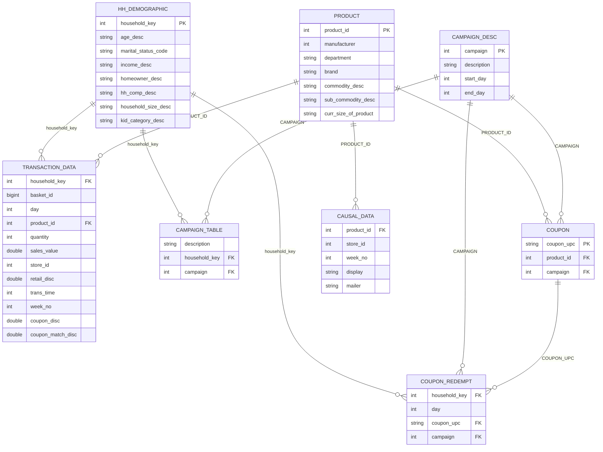

# Dunnhumby 데이터 ERD 및 구조 분석 보고서

## 1. 테이블 구조 정리

분석에 사용된 Dunnhumby 데이터셋의 각 테이블 구조를 다음과 같이 정리합니다.

### 1-1. hh_demographic (고객 인구통계 정보)
- **Primary Key**: `household_key`
- **Foreign Key**: 없음
- **분석 단위**: 가구(Household) 단위의 인구통계 특성 정보
- **설명**: 고객의 연령, 결혼 여부, 수입, 주거 형태 등을 포함합니다.

### 1-2. product (상품 정보)
- **Primary Key**: `PRODUCT_ID`
- **Foreign Key**: 없음
- **분석 단위**: 개별 상품(Product) 단위
- **설명**: 상품의 제조사, 부서, 브랜드, 상품군(Commodity) 정보를 포함합니다.

### 1-3. transaction_data (거래 내역 정보)
- **Primary Key**: (Composite) `household_key`, `BASKET_ID`, `DAY`, `PRODUCT_ID`, `TRANS_TIME`
- **Foreign Key**: `household_key` (hh_demographic), `PRODUCT_ID` (product)
- **분석 단위**: 장바구니 내 개별 상품 거래 건(Transaction Line Item)
- **설명**: 실제 판매 데이터, 수량, 매출액, 할인액 등의 정보를 포함합니다.

### 1-4. campaign_desc (캠페인 설명)
- **Primary Key**: `CAMPAIGN`
- **Foreign Key**: 없음
- **분석 단위**: 마케팅 캠페인 단위
- **설명**: 각 캠페인의 구분 및 시작/종료일 정보를 포함합니다.

### 1-5. campaign_table (캠페인 대상 가구)
- **Primary Key**: (Composite) `household_key`, `CAMPAIGN`
- **Foreign Key**: `household_key` (hh_demographic), `CAMPAIGN` (campaign_desc)
- **분석 단위**: 가구별 캠페인 타겟팅 건
- **설명**: 특정 캠페인이 어떤 가구를 대상으로 진행되었는지 기록합니다.

### 1-6. coupon (쿠폰 정보)
- **Primary Key**: (Composite) `COUPON_UPC`, `PRODUCT_ID`, `CAMPAIGN`
- **Foreign Key**: `PRODUCT_ID` (product), `CAMPAIGN` (campaign_desc)
- **분석 단위**: 상품별 적용 가능한 쿠폰 건
- **설명**: 특정 캠페인에서 특정 상품에 사용 가능한 쿠폰 번호를 매핑합니다.

### 1-7. coupon_redempt (쿠폰 사용 내역)
- **Primary Key**: (Composite) `household_key`, `DAY`, `COUPON_UPC`, `CAMPAIGN`
- **Foreign Key**: `household_key` (hh_demographic), `COUPON_UPC` (coupon), `CAMPAIGN` (campaign_desc)
- **분석 단위**: 가구의 쿠폰 사용(Redemption) 건
- **설명**: 고객이 언제 어떤 쿠폰을 사용했는지 기록합니다.

### 1-8. causal_data (보조 마케팅 정보)
- **Primary Key**: (Composite) `PRODUCT_ID`, `STORE_ID`, `WEEK_NO`
- **Foreign Key**: `PRODUCT_ID` (product)
- **분석 단위**: 주차별/매장별 상품 노출 정보
- **설명**: 매장 내 디스플레이(display)나 우편 광고(mailer) 노출 여부를 포함합니다.

---

## 2. ERD (Entity Relationship Diagram)

---

## 3. 분석 점검

### 3-1. 고객 단위 분석에 직접 사용 가능한 테이블
- **TRANSACTION_DATA**: 매출액, 가계 지출 패턴 분석의 핵심
- **HH_DEMOGRAPHIC**: 고객 페르소나 정의 및 세그먼트 분석
- **CAMPAIGN_TABLE / COUPON_REDEMPT**: 마케팅 반응도 및 로열티 분석

### 3-2. 보조 정보 테이블
- **PRODUCT**: 상품 카테고리별 분석을 위한 마스터 정보
- **CAMPAIGN_DESC**: 마케팅 기간 정의를 위한 메타 데이터
- **COUPON**: 쿠폰 마스터 정보
- **CAUSAL_DATA**: 매장 내 노출 변수 통제를 위한 배경 정보
